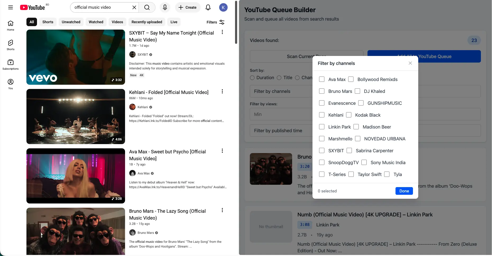
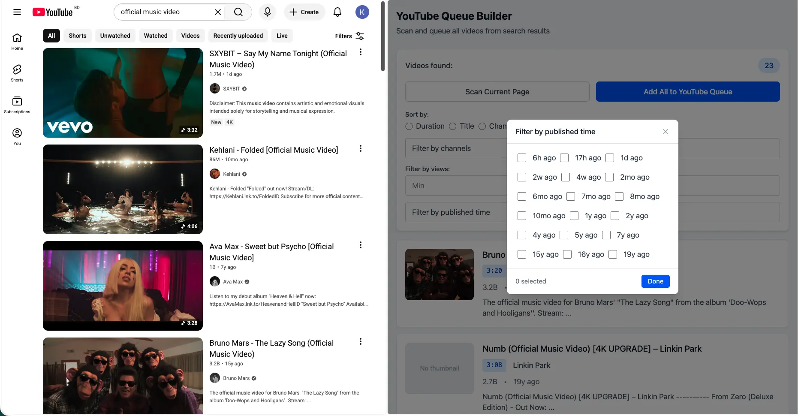
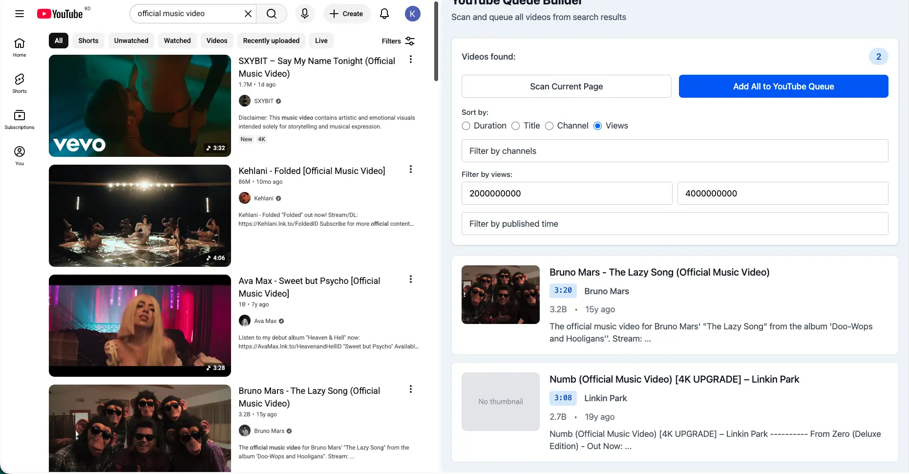

# YouTube Queue Builder

A Chrome extension that scans YouTube search results and builds instant watch queues.

## Features

- Scan all videos from a YouTube search results page
- Filter videos by channel (supports multi-select)

  

- Sort by duration, views, title, or channel

   

- Add filtered videos to a YouTube watch queue in one click

  

## Installation

1. Run `bun run build` to build the extension
2. Open `chrome://extensions/` and enable Developer mode
3. Click "Load unpacked" and select the `dist/` folder

## Development

```bash
bun install       # Install dependencies
bun run dev       # Start dev server (sidebar UI only)
bun run build     # Build extension to dist/
git config user.email kabir.signup@gmail.com
git config user.name "Kabir Khyrul"
```

## Usage

1. Go to `https://www.youtube.com/results?search_query=...`
2. Open the extension sidebar
3. Click "Scan Current Page"
4. Filter and sort results as needed
5. Click "Add All to YouTube Queue"
